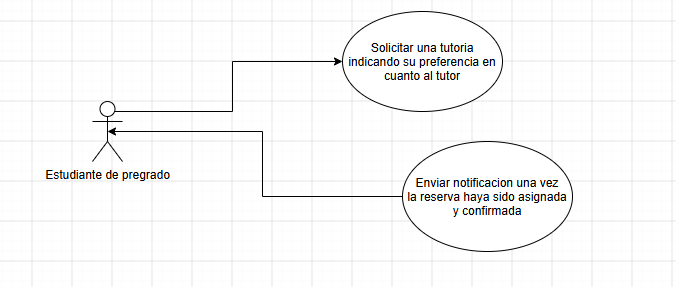

# DOSW_ParcialT1_SantiagoGomez

# TutoECI

# Gestion y asignacion de tutorias

# Punto 1

Diagrama de contexto C4:

# Punto 2

Requerimientos funcionales: 

RF1: El estudiante de pregrado debe poder solicitar una tutoria indicando su preferencia en cuanto al tutor. (Factory method)

RF2: El sistema debe asignar un tutor al estudiante basandose en las 3 preferencias de busqueda.

RF3: El sistema debe enviar una notificacion al estudiante una vez la reserva haya sido asignada y confirmada.

Requerimientos no funcionales:

RN1: La interfaz grafica de usuario debe ser adaptable (responsive design) a dispositivos moviles y de escritorio.

RN2: El diseño debe incorporar la identidad visual institucional, respetando la paleta de colores oficial del Programa de Ingenieria de Sistemas de la Escuela.

Historias de Usuario:

HU1: Como estudiante de pregrado, quiero solicitar una tutoría indicando mi preferencia de tutor (profesor o estudiante de posgrado), para que el sistema me asigne el mejor tutor disponible.

HU2: Como profesor, quiero dar tutorias (max. 30 minutos), para que los estudiante logren mejorar sus califaciones.

HU3: Como estudiante de posgrado, quiero dar tutorias (max. 60 minutos), para que los estudiantes mejoren tanto sus calficaciones como su conocimiento general del programa.

HU4: Como estudiante de pregrado, quiero confirmar y asistir a una tutoría, para que el tutor me pueda brindar sus conocimientos.

Diagrama de casos de uso:

Sobre: 

RF1: El estudiante de pregrado debe poder solicitar una tutoria indicando su preferencia en cuanto al tutor. (Factory method)

RF3: El sistema debe enviar una notificacion al estudiante una vez la reserva haya sido asignada y confirmada.

# Punto 3

Epic: Gestion y asignacion de tutorias: TutoECI necesita permitir que los estudiantes puedan solicitar tutorias directamente desde la plataforma, definiendo la preferencia en cuanto al tutor, basandose en 3 preferencias de busqueda FASTEST_AVAILABLE, EXPERT_FIRST y PEER_TUTORING.

Historia de usuario: Solicitar tutoria con preferencia de tutor: Como estudiante de pregrado, quiero solicitar una tutoría indicando mi preferencia de tutor (profesor o estudiante de posgrado), para que el sistema me asigne el mejor tutor disponible

Tareas:

1. Implementar la logica de seleccion del tutor: Implementar la logica de seleccion del tutor en base a la informacion que el estudiante digite en el Formulario Preferencia Tutor en el cual podra elegir entre 3 posibles preferencias para la busqueda del tutor.

2. Implementar navegación hacia el Formulario Preferencia Tutor: Implementar la lógica de navegación para que, al hacer clic en "Solicitar Tutoria", el estudiante sea redirigido a la pantalla Formulario Preferencia Tutor.

3. Implementar conexion con el sistema Enlace Academico: Implementar la conexion con Enlace Academico para que el sistema pueda enviarle el Id del estudiante y enlace retorne Id, nombre programa, materias inscritas.

Enlace Jira: https://nicolasdrodriguez.atlassian.net/jira/software/projects/DPS/boards/35/backlog?atlOrigin=eyJpIjoiMWY2MDdlOTVkNmEzNGRlN2JjNTFjYjgzYjU3YTQxMDgiLCJwIjoiaiJ9

# Pull Requests

Enlace pull requests: https://github.com/gomezsantiago0/DOSW_ParcialT1_SantiagoGomez/pulls
